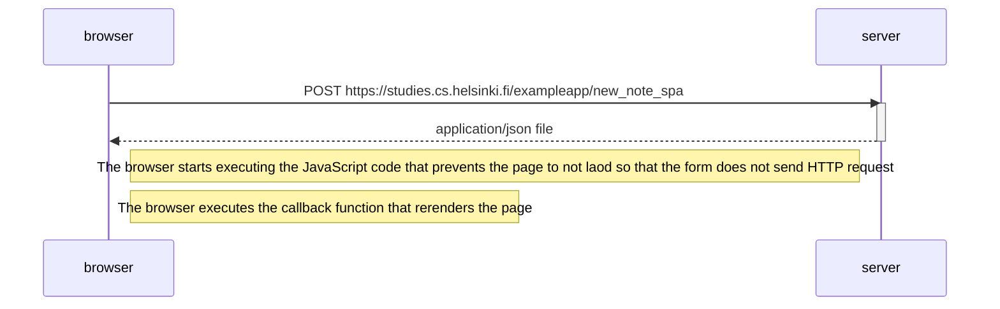

```mermaid
sequenceDiagram
participant browser
participant server

    browser->>server: POST https://studies.cs.helsinki.fi/exampleapp/new_note_spa

    activate server

    server-->>browser: application/json file

    deactivate server

    Note right of browser: The browser starts executing the JavaScript code that prevents the page to not laod so that the form does not send HTTP request

    Note right of browser: The browser executes the callback function that rerenders the page
```
