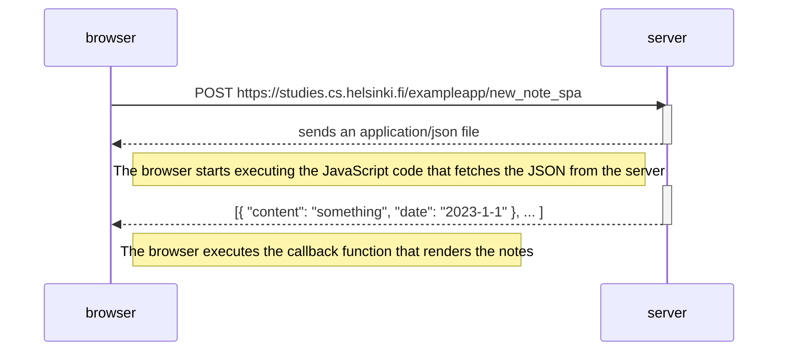

```mermaid
sequenceDiagram
participant browser
participant server

    browser->>server: POST https://studies.cs.helsinki.fi/exampleapp/new_note_spa

    activate server

    server-->>browser: sends an application/json file

    deactivate server

    Note right of browser: The browser starts executing the JavaScript code that fetches the JSON from the server

    activate server
    server-->>browser: [{ "content": "something", "date": "2023-1-1" }, ... ]
    deactivate server

    Note right of browser: The browser executes the callback function that renders the notes
```
